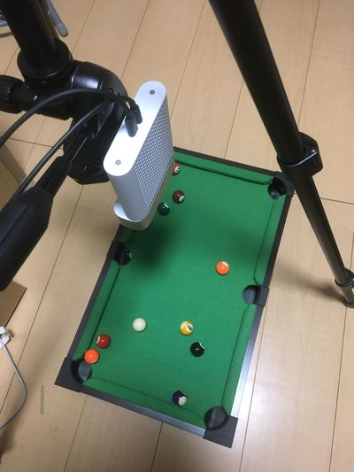

3D billiard table recognition
===

Kinect Azureでビリヤードのミニテーブルを撮影し、台と台上のボールの認識を行うプロジェクトです。

付帯しているデータを使えばKinectとビリヤードの台はなくても試せます。

[Open3D](http://www.open3d.org/docs/release/)の公式のドキュメントやexamplesを参考に開発しています。



過去に[別のレポジトリ](https://github.com/yudai09/study_opencv_billiards)で同じミニテーブルを2D（RGB）としてOpenCVで処理して同様の処理を行いました。

# Requirements
Open3D == 0.9

# Install
```shell
$ pip install open3d
```

# Usage
1_draw_geometries.pyから5_global_registration_two_images.pyを実行してください。引数は不要です。

## 各ファイルの説明
* 0_point_cloud_data_from_kinect.py KinectでRGBD画像を撮影し、PLYデータに変換して保存します。data/配下に保存されたデータを使う場合にはこのファイルの実行は不要です。
* 1_draw_geometries.py data/billiard_table.plyの3D画像を表示します。
* 2_segment_table.py RANSACにより平面を検出するアルゴリズムを使ってビリヤードテーブルの面を検出します。
* 3_segment_object_on_table.py 2_segment_table.pyにより検出された平面よりも上にある点群を可視化します。
* 4_dbscan_object_on_table.py 3_segment_object_on_table.pyにより検出された点群をDBSCANによりクラスタリングし可視化します。これにより玉とバンクが異なるオブジェクトとして認識できます。
* 5_global_registration_two_images.py 2つの異なる視点から撮影した点群をRANSACにより重ねます。（1〜4の処理とは無関係です）

### 動作デモ

[](http://www.youtube.com/watch?v=6uDkti-5O1E "1_draw_geometries.py")
[](http://www.youtube.com/watch?v=NzoxiASJFSM "2_segment_table.py")
[](http://www.youtube.com/watch?v=hQ32lroSmrM "3_segment_object_on_table.py")
[](http://www.youtube.com/watch?v=ke5-wfmHF0s "4_dbscan_object_on_table.py")

# TODO
* ボールの番号の認識（多分CNNを使うことになる）
* ボールの中心座標の取得。Depthカメラの性質上、真球にはならないが計算でカバーできそう